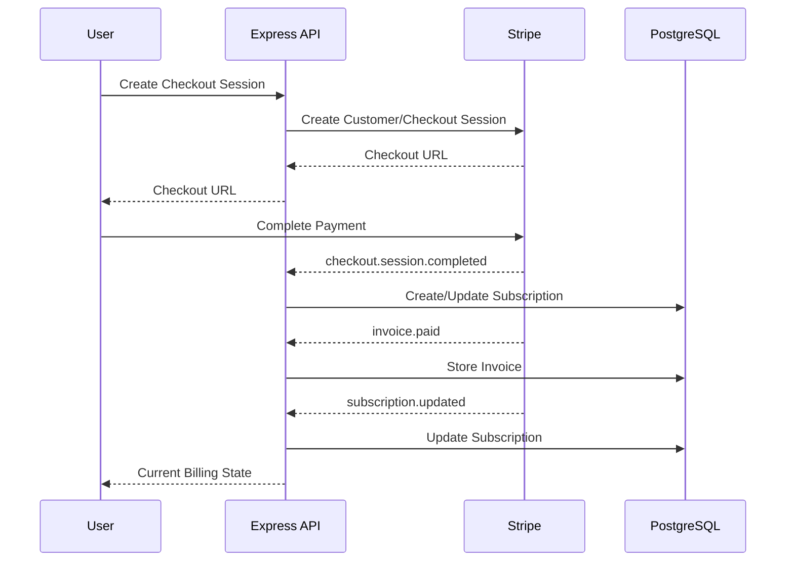

# Payment Subscription API

This project is a production-ready subscription-based SaaS billing backend built with Node.js, TypeScript, Express, PostgreSQL, Prisma, Redis, Stripe, JWT and Swagger.

## Features

- JWT authentication
- Subscription plans
- Stripe checkout
- Stripe customer management
- Stripe webhooks
- Webhook signature verification
- Webhook idempotency
- Subscription lifecycle
- Billing portal
- Invoices
- Usage tracking
- Redis quotas
- 429 quota protection
- Admin subscription management
- Revenue analytics
- Swagger documentation
- Tests

## Architecture



## Setup

```bash
git clone <repository-url>
cd payment-subscription-api
npm install
```

Start infrastructure:

```bash
docker compose up -d
```

Run Prisma:

```bash
npx prisma generate
npx prisma migrate dev
npx prisma db seed
```

Start development:

```bash
npm run dev
```

Production:

```bash
npm start
```

Swagger: http://localhost:5000/api/docs
Health: http://localhost:5000/api/health

## Stripe Test Mode

Configure environment variables from `.env.example`:

```env
STRIPE_SECRET_KEY=sk_test_...
STRIPE_WEBHOOK_SECRET=whsec_...
```

Create Stripe products and prices in test mode, then configure the corresponding price IDs in environment variables. Use the Stripe CLI to forward webhook events locally:

```bash
stripe login
stripe listen --forward-to localhost:5000/api/webhooks/stripe
```

## Project Structure

The repository includes the requested Express architecture with controllers, services, middleware, routes, validators, utilities, Prisma schema, seed file, tests, docs and OpenAPI configuration.
